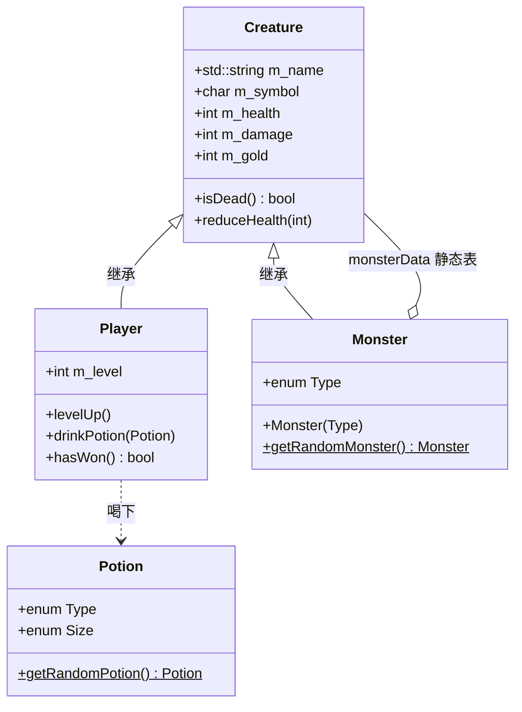

# LearnCpp 小项目集

<p align="center">
  
  
  
</p>

<p align="center">
  从 <a href="https://www.learncpp.com/">LearnCpp</a> / <a href="https://learncpp.cn/">learncpp.cn</a>
  教程中整理出的<strong>可独立编译、可直接游玩</strong>的控制台小项目。
</p>

---

每个子目录都是一个完整程序：源码、依赖头文件都在目录内，进入后一条命令即可编译运行。

需要随机数的项目已各自附带 LearnCpp 官方的 `Random.h`（自播种 Mersenne Twister，要求 **C++17**）。

## 目录

- [项目一览](#项目一览)
- [环境要求](#环境要求)
- [编译与运行](#编译与运行)
- [项目说明](#项目说明)
  - [calculator](#calculator--健壮计算器)
  - [hangman](#hangman--cman-猜单词)
  - [potion-shop](#potion-shop--roscoe-的药水铺)
  - [blackjack](#blackjack--简化版二十一点)
  - [square-guess](#square-guess--平方数竞猜)
  - [puzzle-15](#puzzle-15--十五数字推盘)
  - [monster-hunter](#monster-hunter--打怪升级)
- [未收录的内容](#未收录的内容)
- [相关项目](#相关项目)
- [致谢](#致谢)

## 项目一览

| 目录 | 教程来源 | 类型 | 教程在做什么 |
| :--- | :--- | :--- | :--- |
| [`calculator/`](calculator/) | [9.5 std::cin 和处理无效输入](https://learncpp.cn/cpp-tutorial/stdcin-and-handling-invalid-input/) | 工具 | 把一个会崩的四则运算器改成健壮程序 |
| [`hangman/`](hangman/) | [16.x 测验 Q5：C++man](https://learncpp.cn/cpp-tutorial/chapter-16-summary-and-quiz/) | 游戏 | 用 `std::vector` / `std::array` 实现猜单词 |
| [`potion-shop/`](potion-shop/) | [17.x 测验 Q2：Roscoe 药水店](https://learncpp.cn/cpp-tutorial/chapter-17-summary-and-quiz/) | 游戏 | 用 `std::array` + 枚举做商店与库存 |
| [`blackjack/`](blackjack/) | [17.x 测验 Q3–Q5：二十一点](https://learncpp.cn/cpp-tutorial/chapter-17-summary-and-quiz/) | 游戏 | 用 `Card` / `Deck` 实现简化 Blackjack |
| [`square-guess/`](square-guess/) | [20.7 测验 Q3：平方数游戏](https://learncpp.cn/cpp-tutorial/lambda-captures/) | 游戏 | 用 `std::find` 和 lambda 找最接近值 |
| [`puzzle-15/`](puzzle-15/) | [21.y 第 21 章项目](https://learncpp.cn/cpp-tutorial/chapter-21-project/) | 游戏 | 运算符重载章的综合项目：15 拼图 |
| [`monster-hunter/`](monster-hunter/) | [24.x 测验 Q3：打怪游戏](https://learncpp.cn/cpp-tutorial/chapter-24-summary-and-quiz/) | 游戏 | 继承：`Creature` → `Player` / `Monster` |

## 环境要求

- **C++17** 或更新（`Random.h` 依赖 inline 变量）
- **g++**（本仓库在 MinGW-w64 上验证通过）
- 终端 / PowerShell / cmd 均可

## 编译与运行

在任意项目目录下：

```bash
g++ -std=c++17 -O2 -Wall -Wextra -o main.exe main.cpp
```

Windows 下直接运行：

```bat
main.exe
```

一次性编译全部项目（PowerShell）：

```powershell
Get-ChildItem -Directory | ForEach-Object {
    Push-Location $_.FullName
    Write-Host "Building $($_.Name) ..."
    g++ -std=c++17 -O2 -Wall -Wextra -o main.exe main.cpp
    if ($LASTEXITCODE -eq 0) { Write-Host "  OK" -ForegroundColor Green }
    else { Write-Host "  FAIL" -ForegroundColor Red }
    Pop-Location
}
```

## 项目说明

### calculator — 健壮计算器

> 教程：[9.5 — std::cin 和处理无效输入](https://learncpp.cn/cpp-tutorial/stdcin-and-handling-invalid-input/)

教程用一个「没有任何错误处理的四则运算器」开场：读两个小数和一个运算符，打印结果。然后逐个拆开用户会怎样把它玩坏，再把处理补回去。一个能优雅应对错误输入的程序，教程称之为**健壮**（robust）。

程序要求输入：

1. 一个小数
2. 运算符：`+` `-` `*` `/`
3. 另一个小数

然后打印 `x op y is <结果>`。

教程归纳的四类文本输入错误，本实现都覆盖了：

| 错误 | 例子 | 处理 |
| :--- | :--- | :--- |
| 提取成功但输入无意义 | 运算符输入 `k` | 循环提示，直到拿到 `+ - * /` |
| 提取成功但有多余输入 | 第一个数输入 `5*7` | `ignoreLine()` 丢掉行尾剩余字符 |
| 提取失败 | 把 `a` 读进 `double` | `cin.clear()` + 清缓冲，再问一次 |
| 流被关掉（EOF） | Windows `Ctrl+Z` / Unix `Ctrl+D` | `std::exit(0)`，避免无限循环 |
| 除数为 0 | `/` 且第二个数是 `0` | 单独再要一个分母 |

```
Enter a decimal number: 5
Enter one of the following: +, -, *, or /: *
Enter a decimal number: 7
5 * 7 is 35
```

### hangman — C++man 猜单词

> 教程：[16.x — 第 16 章总结和测验 · 问题 #5](https://learncpp.cn/cpp-tutorial/chapter-16-summary-and-quiz/)

第 16 章讲完 `std::vector` 后的综合游戏。教程把它叫做 **C++man**，规则是经典 [Hangman](https://en.wikipedia.org/wiki/Hangman_(game)) 的变体，用 `+` 表示剩余错误次数——`+` 用完即负。

**高层次规则（原文）：**

- 电脑随机选一个单词，为每个字母画一个下划线。
- 玩家在用完可配置的 X 次错误猜测之前猜出全部字母即胜。本实现 `X = 6`。

**每回合：**

- 玩家猜一个字母。
- 已经猜过的字母不计，游戏继续。
- 若单词里有该字母，对应下划线换成字母。
- 若没有，消耗一次错误机会。

**玩家应能看到：**

- 还剩多少次错误机会（一排 `+`）
- 已经猜错的字母（按字母表顺序跟在 `+` 后面）

起始词库（可自行加词）：

`mystery` `broccoli` `account` `almost` `spaghetti` `opinion` `beautiful` `distance` `luggage`

```
Welcome to C++man (a variant of Hangman)
To win: guess the word.  To lose: run out of pluses.

The word: ________   Wrong guesses: ++++++
Enter your next letter: a
No, 'a' is not in the word!

The word: ________   Wrong guesses: +++++a
Enter your next letter: b
Yes, 'b' is in the word!

The word: b_______   Wrong guesses: +++++a
```

非法字符（如 `%`）会提示 `That wasn't a valid input.`；重复猜测会提示 `You already guessed that.`

### potion-shop — Roscoe 的药水铺

> 教程：[17.x — 第 17 章总结和测验 · 问题 #2](https://learncpp.cn/cpp-tutorial/chapter-17-summary-and-quiz/)

教程原文：「本次测验，我们将实现罗斯科的药水店，这片土地上最好的药水店！」用 `std::array` 和枚举把商品、价格、库存绑在一起。

**货架（编号 / 名称 / 价格）：**

| 编号 | 药水 | 价格 |
| :---: | :--- | ---: |
| 0 | healing | 20 |
| 1 | mana | 30 |
| 2 | speed | 12 |
| 3 | invisibility | 50 |

**流程：**

1. 欢迎语，询问玩家名字。
2. 起始金币在 **80–120** 之间随机。
3. 反复展示货架。输入药水编号购买，输入 `q` 离店。
4. 金币不够则提示 `You can not afford that.`，不扣款。
5. 离店后打印库存和剩余金币。

无效输入（例如 `d`、带多余字符的 `2d` / `25`）一律视为失败，要求重输。这是教程明确要求对照 [9.5](https://learncpp.cn/cpp-tutorial/stdcin-and-handling-invalid-input/) 做的。

```
Welcome to Roscoe's potion emporium!
Enter your name: Alex
Hello, Alex, you have 85 gold.

Here is our selection for today:
0) healing costs 20
1) mana costs 30
2) speed costs 12
3) invisibility costs 50
Enter the number of the potion you'd like to buy, or 'q' to quit: 3
You purchased a potion of invisibility.  You have 35 gold left.
```

离店结算示例：

```
Your inventory contains:
2x potion of speed
1x potion of invisibility
You escaped with 11 gold remaining.

Thanks for shopping at Roscoe's potion emporium!
```

### blackjack — 简化版二十一点

> 教程：[17.x 问题 #3 牌组](https://learncpp.cn/cpp-tutorial/chapter-17-summary-and-quiz/) + [问题 #4–#5 二十一点](https://learncpp.cn/cpp-tutorial/chapter-17-summary-and-quiz/)

先在 Q3 搭 `Card` / `Deck`（52 张、洗牌、发牌），再在 Q4 做成简化 Blackjack。本仓库实现了 Q5 额外要求：A 可作 1 或 11、平局单独判定。

**牌面打印：** 两点代码，例如黑桃 J → `JS`，红桃 A → `AH`，10 → `T`。花色 `C D H S`。

**本版本规则（对照教程）：**

- 庄家先亮一张牌；玩家先发两张明牌。
- 玩家回合反复 `(h)it` 要牌或 `(s)tand` 停牌。
- A 默认 11；总分超过 21 且手里还有按 11 计的 A 时，自动降为 1（减 10）。
- 超过 21 立即爆牌。
- 庄家不到 **17** 必须继续要牌，达到 17 必须停。
- 庄家爆牌则玩家赢；双方都没爆则比点数，相同为平局。

不跟踪具体手牌集合，只跟踪分数（以及还按 11 计的 A 的数量）。

```
The dealer is showing JH (10)
You are showing AH 7D (18)
(h) to hit, or (s) to stand: h
You were dealt JD.  You now have: 18
(h) to hit, or (s) to stand: s
The dealer flips a 6C.  They now have: 16
The dealer flips a AD.  They now have: 17
You win!
```

### square-guess — 平方数竞猜

> 教程：[20.7 — Lambda 捕获 · 问题 #3](https://learncpp.cn/cpp-tutorial/lambda-captures/)

第 20.7 课讲完 lambda 捕获后的小游戏：生成一串「平方数 × 随机乘数」，让玩家把它们逐个猜出来。找「最接近的未猜中数字」必须用 `std::min_element` + 捕获 `guess` 的 lambda，这正是本课要练的点。

**设置：**

1. `Start where?` — 起始整数，例如 `4`。
2. `How many?` — 要生成几个连续平方。
3. 程序抽一个随机乘数。教程原文范围是 2–4；本实现是 **2–6**。
4. 从起始数起，第 `i` 个数为 `(start + i)² × 乘数`。

**游玩：**

- 猜中：从列表里删掉该数，提示还剩几个。
- 全部猜中：`You found all numbers, good job!`
- 猜错：告诉玩家最接近的未猜中值，游戏结束。

教程给出的第一段示例：

```
Start where? 4
How many? 5
I generated 5 square numbers. Do you know what each number is after multiplying it by 2?
> 32
Nice! 4 number(s) left.
> 72
Nice! 3 number(s) left.
> 50
Nice! 2 number(s) left.
> 126
126 is wrong! Try 128 next time.
```

解释：从 4 起 5 个平方是 `16 25 36 49 64`，乘 2 后是 `32 50 72 98 128`。`126` 不在列表里，最接近的是 `128`。

全对的示例：

```
Start where? 1
How many? 3
I generated 3 square numbers. Do you know what each number is after multiplying it by 4?
> 4
Nice! 2 number(s) left.
> 16
Nice! 1 number(s) left.
> 36
Nice! You found all numbers, good job!
```

### puzzle-15 — 十五数字推盘

> 教程：[21.y — 第 21 章项目](https://learncpp.cn/cpp-tutorial/chapter-21-project/)（向读者 Avtem 致谢）

运算符重载章结束后的独立项目，实现经典 [15 Puzzle](https://en.wikipedia.org/wiki/15_puzzle)。4×4 格子里 15 块编号砖和 1 个空位；每次把空位旁的砖滑进去。目标是排成：

```
  1   2   3   4
  5   6   7   8
  9  10  11  12
 13  14  15
```

空位在右下角。

教程要求分阶段搭：`Tile` → 已解决的 `Board` → 命令输入 → `Direction` → `Point` → 滑动 → 打乱 → 胜利判定。

**命令：**

| 键 | 动作 |
| :---: | :--- |
| `w` | 向上滑 |
| `a` | 向左滑 |
| `s` | 向下滑 |
| `d` | 向右滑 |
| `q` | 退出（打印 `Bye!`） |

无效命令和多余输入直接忽略。打印棋盘前先输出约 25 行空行，把旧画面顶出视野。

打乱方式与实体拼图一样：从已解决状态出发，对空位做 1000 次随机合法滑动，因此打乱后的盘面一定可解。

```
 12  10   3   2
  9   7   6   4
 15   1      13
  8  14   5  11
```

排好后打印 `You won!`。

### monster-hunter — 打怪升级

> 教程：[24.x — 第 24 章总结与测验 · 问题 #3](https://learncpp.cn/cpp-tutorial/chapter-24-summary-and-quiz/)

继承章的挑战题。教程原文：「我们将编写一个简单的游戏，你将在其中与怪物战斗。游戏的目标是在你死亡或达到 20 级之前收集尽可能多的金币。」本实现包含 g) 额外奖励的随机药水。

三个类：`Creature` 基类，`Player` 和 `Monster` 派生。



`Monster` 不存自己的数据，而是引用一张 `inline static` 的 `Creature` 预设表（带 `static_assert` 校验数组与枚举数量一致）；`Potion` 与战斗系统解耦，只由 `Player::drinkPotion()` 消费。

**玩家初始：** 符号 `@`，生命 10，伤害 1，金币 0，等级 1。升级时等级和伤害各 +1。到 **20 级** 获胜。

**怪物表（教程原文）：**

| 类型 | 名称 | 符号 | 生命 | 伤害 | 金币 |
| :--- | :--- | :---: | ---: | ---: | ---: |
| dragon | dragon | `D` | 20 | 4 | 100 |
| orc | orc | `o` | 4 | 2 | 25 |
| slime | slime | `s` | 1 | 1 | 10 |

**每场遭遇：**

1. 随机生成一只怪物。
2. 选择 `(R)un` 或 `(F)ight`。
3. 逃跑：50% 成功进入下一场；失败则挨一次打，再选行动。
4. 战斗：玩家先手。打死则拿光金币并升级；没打死则怪物反击。
5. 玩家生命 ≤ 0 失败；升到 20 级胜利。

**药水（额外奖励，击杀后 30% 掉落）：**

| 类型 | 小 / 中 | 大 |
| :--- | :--- | :--- |
| Health | +2 生命 | +5 生命 |
| Strength | +1 伤害 | +1 伤害 |
| Poison | -1 生命 | -1 生命 |

掉落时只问喝不喝，喝下去才揭示「尺寸 + 类型」。不喝就消失。

```
Enter your name: Alex
Welcome, Alex
You have encountered a slime (s).
(R)un or (F)ight: f
You hit the slime for 1 damage.
You killed the slime.
You are now level 2.
You found 10 gold.
You found a mythical potion! Do you want to drink it? [y/n]: y
You drank a Medium potion of Poison.
```

死亡结算：

```
You died at level 3 and with 35 gold.
Too bad you can't take it with you!
```

## 未收录的内容

下列文件只是教程片段，不算独立小项目，因此没有放进本仓库：

| 原目录 | 原因 |
| :--- | :--- |
| `2_8/` | 多文件编译入门（`add` 函数声明） |
| `7_2/` | 命名空间 + 头文件示例 |
| `8_15/` | 仅有 `Random.h`，已按需复制到各游戏目录 |
| `17_x/3.cpp` | 空文件 |
| `21_x/` | [21.x Q4 `FixedPoint2`](https://learncpp.cn/cpp-tutorial/chapter-21-summary-and-quiz/) 是定点类单元测试，不是可玩程序 |

## 相关项目

- **rustbook-project**（本机同级目录，尚未推送远程）：《Rust 程序设计语言》教程项目集，含 minigrep 与多线程 Web 服务器。两个仓库的 README 互相参考、徽章风格一致。

## 致谢

源码来自 [LearnCpp](https://www.learncpp.com/) 综合测验与章节练习，中文对照见 [learncpp.cn](https://learncpp.cn/)。各项目标题下的链接指向对应课文。

`Random.h` 来自教程 [Global random numbers (Random.h)](https://www.learncpp.com/cpp-tutorial/global-random-numbers-random-h/)，可按原文许可自由再分发。
